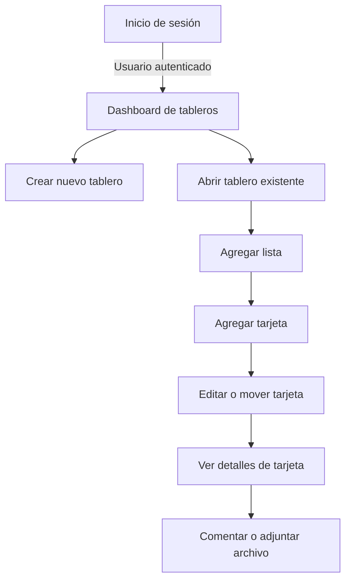
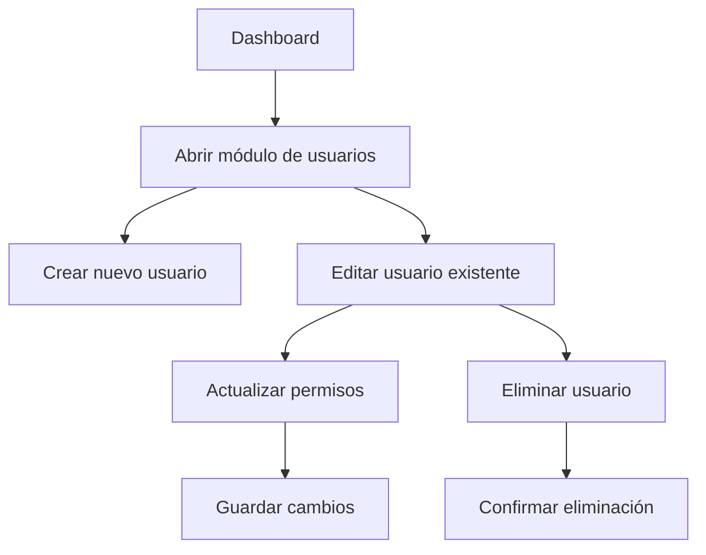

# Ejemplo de diagrama


---


---

### 🔹 Claves para que funcione

1. Cada diagrama **abre y cierra su propio bloque** con ```mermaid```.  
2. Mantén **una línea en blanco o separación** entre bloques (por ejemplo el `---` o solo un salto de línea).  
3. Al guardar y refrescar el README en GitHub, **verás los dos diagramas renderizados uno debajo del otro**.  

Si quieres, puedo hacer una **versión unificada** que combine ambos diagramas en **un único flujo completo** desde login hasta la gestión de usuarios y acciones en el tablero.  
¿Quieres que haga eso?
