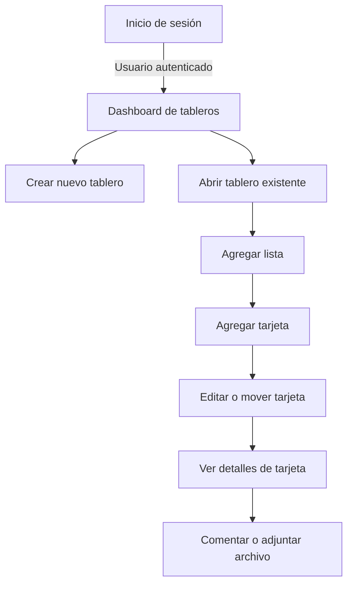
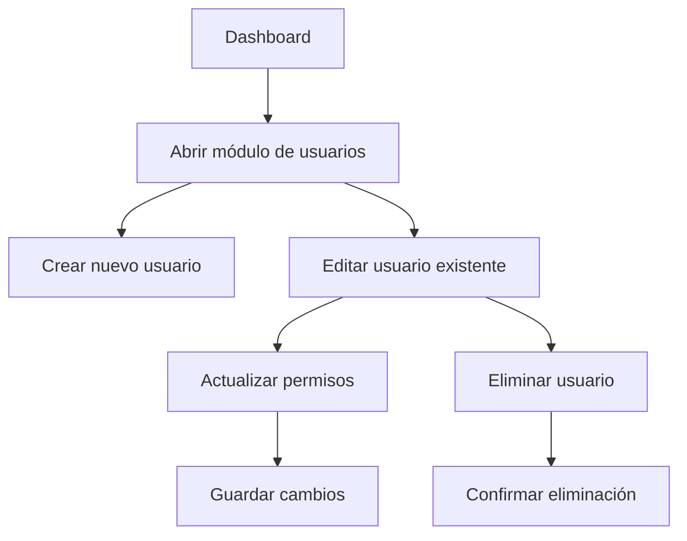
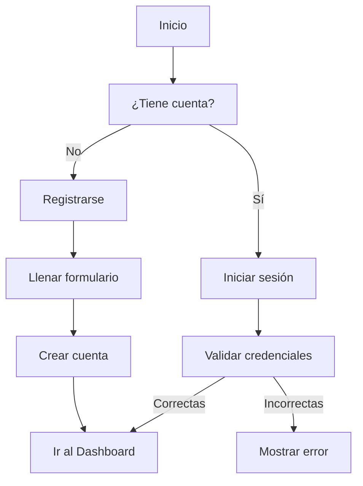
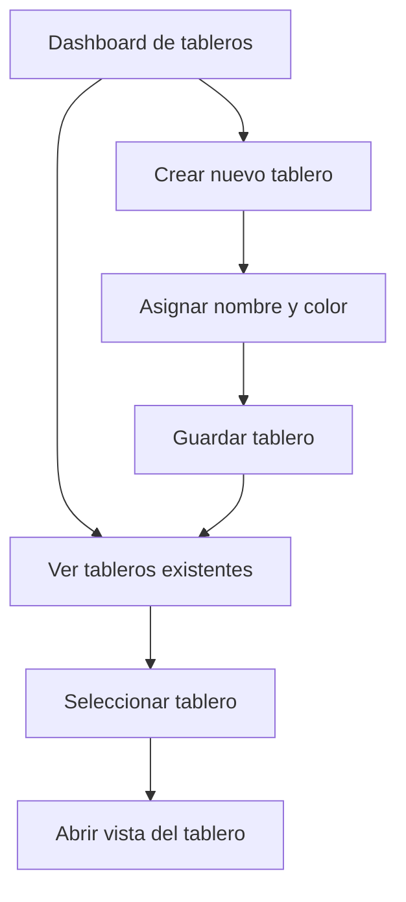
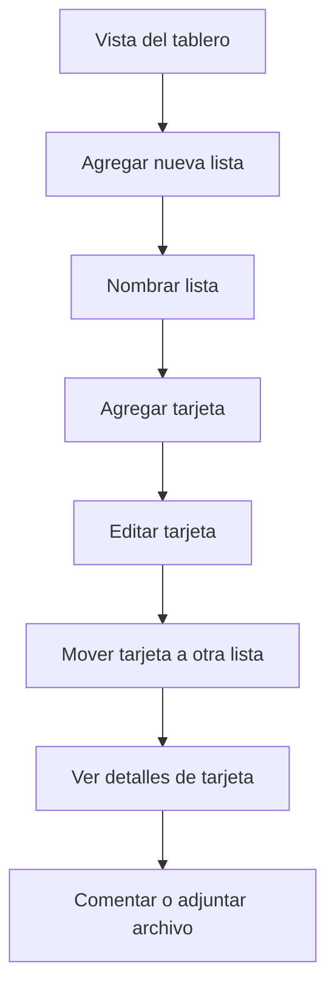
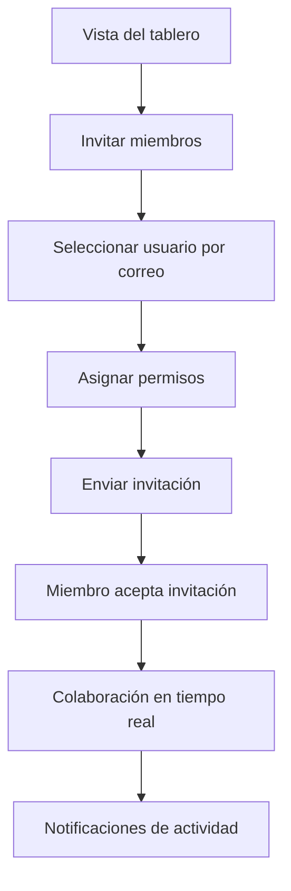
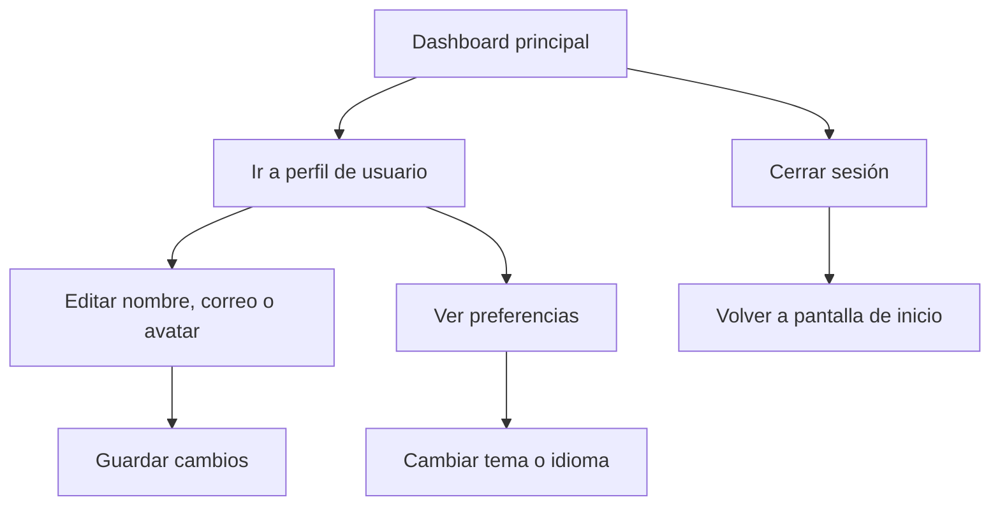

# Ejemplo de diagrama del proyecto Gestion de Proyectos Flujo Base

---

# Ejemplo de diagrama para usuarios

---

# Ejemplo de diagrama para Registro e inicio de Sesion

---

# Ejemplo de diagrama para Gestion de Tableros

---

# Ejemplo de diagrama para Gestión de Listas y Tarjetas

---

# Ejemplo de diagrama para Colaboración y Notificaciones

---

# Ejemplo de diagrama para Configuración y Cierre de Sesión

---

