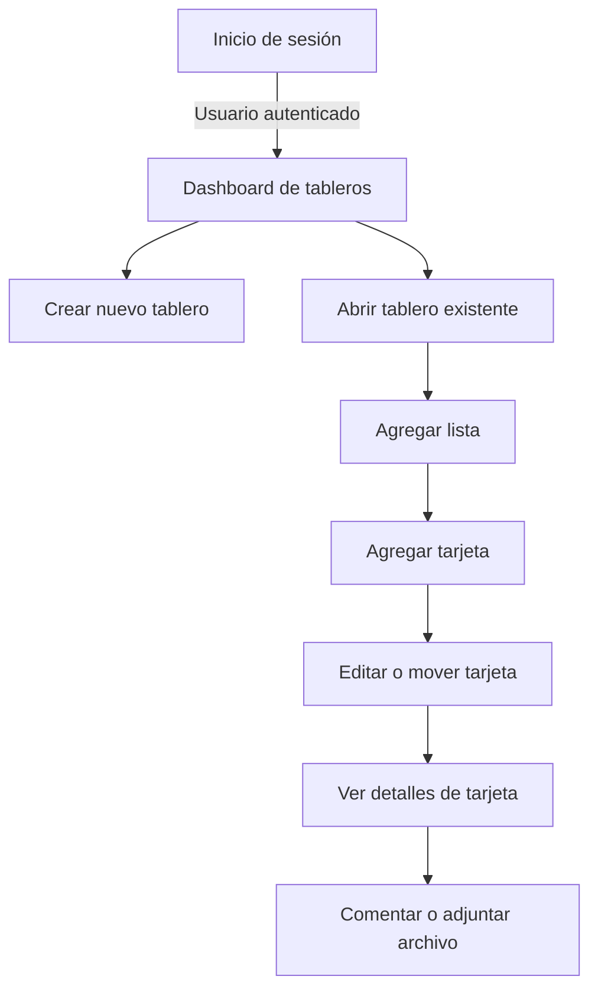

# Ejemplo de diagrama

```mermaid
flowchart TD
  A[Inicio de sesión] -->|Usuario autenticado| B[Dashboard de tableros]
  B --> C[Crear nuevo tablero]
  B --> D[Abrir tablero existente]
  D --> E[Agregar lista]
  E --> F[Agregar tarjeta]
  F --> G[Editar o mover tarjeta]
  G --> H[Ver detalles de tarjeta]
  H --> I[Comentar o adjuntar archivo]
```
---

