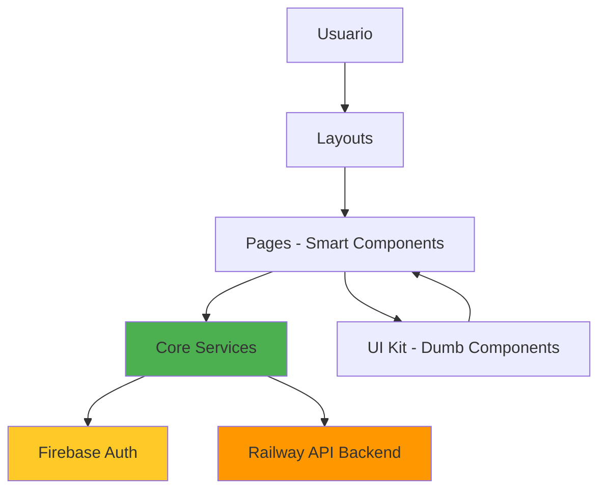

# 🏗️ STRUCTURE.md - Análisis Arquitectónico del Proyecto E-commerce

> **Análisis realizado por:** Arquitecto de Software Senior  
> **Framework:** Angular v20 (Standalone Components)  
> **Fecha:** 2025-11-27

---

## 📊 Árbol de Directorios Principal

```
src/app/
├── components/              # UI Kit - Componentes reutilizables compartidos (15 componentes)
├── core/                    # Capa central - Servicios singleton y lógica transversal
│   ├── constants/           # Constantes globales de la aplicación
│   ├── guards/              # Guards de protección de rutas (admin, session, user)
│   ├── models/              # Modelos de datos TypeScript (9 interfaces/types)
│   └── service/             # Servicios de negocio principales (6 servicios)
├── feature/                 # Módulos de funcionalidad por dominio (3 features)
│   ├── admin/               # Feature de administración del e-commerce
│   ├── auth/                # Feature de autenticación (login, register)
│   └── user/                # Feature de gestión de usuario
├── icons/                   # Componentes de iconos SVG personalizados
├── layouts/                 # Layouts de aplicación (3 layouts)
│   ├── admin-layout/        # Layout para panel de administración
│   ├── shop-layout/         # Layout para la tienda (clientes)
│   └── usuario-layout/      # Layout para área de usuario autenticado
└── page/                    # Páginas/Vistas principales (8 páginas)
    ├── cart/                # Página del carrito de compras
    ├── ckeckout/            # Página de checkout/pago
    ├── frequently-questions/# Página de preguntas frecuentes
    ├── home/                # Página principal/landing
    ├── not-found/           # Página 404
    ├── product-catalog/     # Página de catálogo de productos
    ├── product-detail/      # Página de detalle de producto
    └── user/                # Páginas de usuario (profile, orders)
```

---

## 🎨 Capa de Presentación: `components/` (UI Kit)

**Propósito específico:** Biblioteca de componentes de interfaz reutilizables que conforman el Design System del e-commerce.

### Componentes Identificados:

| Componente | Propósito en el Proyecto |
|------------|--------------------------|
| `acordion/` | Acordeón para FAQs y detalles de producto expandibles |
| `button-theme/` | Botón de cambio de tema (dark/light mode) |
| `cart-dropdown/` | Dropdown del carrito en el header (mini-cart preview) |
| `cart-item/` | Tarjeta de ítem individual dentro del carrito |
| `filter/` | Componente de filtros para el catálogo de productos |
| `footer/` | Footer global de la aplicación |
| `header/` | Header global con navegación y carrito |
| `header/logic/` | ⚠️ **INUSUAL:** Lógica separada del header (ver sección de observaciones) |
| `hero-carrusel/` | Carrusel hero para banners promocionales en home |
| `modal-venta/` | Modal de confirmación de venta/compra |
| `notification-center/` | Centro de notificaciones (alertas, mensajes) |
| `pagination/` | Paginación para listados de productos |
| `product-card/` | Tarjeta de producto para catálogo |
| `product-carousel/` | Carrusel de productos relacionados/destacados |
| `search/` | Barra de búsqueda de productos |
| `terminos-condiciones/` | Modal/componente de términos y condiciones |

**📍 Ubicación de lógica:** Componentes presentacionales puros (Dumb Components). No contienen lógica de negocio.

---

## 🧠 Capa Central: `core/`

**Propósito específico:** Contiene la lógica de negocio transversal, servicios singleton, modelos de datos y mecanismos de protección.

### `core/service/` - Servicios de Negocio

**6 servicios principales identificados:**

#### 1. `auth/` - Servicio de Autenticación
**Archivo:** `auth.ts`  
**Responsabilidades:**
- Autenticación con Firebase (Email/Password y Google OAuth)
- Gestión de sesión con **Signals** (`user` y `role` signals)
- Validación de tokens con backend en Railway
- Recuperación de contraseña
- Manejo de roles (ADMIN, USER, UNKNOWN)

**Tecnologías:**
- Firebase Auth (`signInWithEmailAndPassword`, `signInWithPopup`)
- Angular Signals (estado reactivo moderno)
- HttpClient para validación en backend

**🔍 Observación:** Usa el patrón moderno de **Signals** de Angular 20 en lugar de BehaviorSubjects para el estado del usuario.

#### 2. `cart/` - Servicio de Carrito
**Archivo:** `cart.ts`  
**Responsabilidades:**
- Gestión del carrito de compras en memoria
- Sincronización del carrito con backend (Railway API)
- Validación de stock antes de agregar productos
- Persistencia del carrito por usuario autenticado

**Tecnologías:**
- BehaviorSubject para estado reactivo del carrito
- HttpClient para sincronización con `/cart` endpoint

**🔍 Observación:** Usa **BehaviorSubject** (patrón tradicional) en lugar de Signals. Podría modernizarse.

#### 3. `products/` - Servicio de Productos
**Responsabilidades:**
- Obtención de productos desde la API de Railway
- Gestión de catálogo y búsqueda
- Filtrado por categorías

#### 4. `orders/` - Servicio de Órdenes
**Responsabilidades:**
- Creación de órdenes de compra
- Consulta de historial de pedidos
- Gestión de estados de órdenes (pendiente, completado, cancelado)

#### 5. `categories/` - Servicio de Categorías
**Responsabilidades:**
- Obtención de categorías de productos
- Filtrado y organización del catálogo

#### 6. `notification/` - Servicio de Notificaciones
**Responsabilidades:**
- Sistema de notificaciones toast/snackbar
- Alertas de acciones (producto añadido, error, éxito)

---

### `core/models/` - Modelos de Datos

**9 modelos TypeScript identificados:**

| Modelo | Propósito |
|--------|-----------|
| `product.model.ts` | Estructura de producto (id, name, price, stock, category, images) |
| `cart-item.model.ts` | Ítem del carrito (producto + quantity) |
| `order.model.ts` | Estructura de orden de compra |
| `category.model.ts` | Categoría de productos |
| `role.model.ts` | Enum de roles (ADMIN, USER, UNKNOWN) |
| `status.model.ts` | Estados de órdenes |
| `header.ts` | Modelo para configuración del header |
| `CarouselSlide.ts` | Modelo para slides del carrusel |
| `customResponse.ts` | Estructura de respuestas HTTP personalizadas |

---

### `core/guards/` - Protección de Rutas

**3 guards implementados:**

| Guard | Propósito Específico |
|-------|---------------------|
| `admin/admin-guard.ts` | Protege rutas `/admin/*` - Solo usuarios con rol ADMIN |
| `user/user-guard.ts` | Protege rutas `/user/*` - Solo usuarios autenticados con rol USER |
| `session/session-guard.ts` | Protege rutas que requieren autenticación (cart, checkout) |

**🔍 Observación:** Implementación correcta de RBAC (Role-Based Access Control).

---

## 🎯 Capa de Funcionalidades: `feature/`

**Propósito específico:** Módulos de funcionalidad organizados por dominio de negocio (Feature-Based Architecture).

### 1. `feature/admin/` - Administración del E-commerce

**Estructura:**
```
admin/
├── admin-dashboard/         # Dashboard principal de admin
└── components/              # Componentes específicos de admin (7 componentes)
    ├── categories/          # Gestión de categorías (CRUD)
    ├── modal/               # Modales de admin (crear/editar producto, categoría)
    ├── order-detail/        # Detalle de orden para admin
    ├── orders/              # Lista de todas las órdenes
    ├── products/            # Gestión de productos (CRUD con ag-Grid)
    ├── search-bar/          # Barra de búsqueda del panel admin
    └── sidebar/             # Sidebar de navegación del admin
```

**📍 Lógica de negocio:** Gestión completa del inventario, órdenes y categorías. Usa **ag-Grid** para tablas de datos.

---

### 2. `feature/auth/` - Autenticación

**Estructura:**
```
auth/
├── login/                   # Componente de login (Email/Pass + Google)
└── register/                # Componente de registro de nuevos usuarios
```

**📍 Lógica de negocio:** Formularios de autenticación que consumen el servicio `core/service/auth`.

---

### 3. `feature/user/` - Área de Usuario

**Estructura:**
```
user/
└── Components/              # ⚠️ INUSUAL: Mayúscula en "Components"
    ├── orders/              # Componentes de órdenes del usuario
    │   └── orders-detail/   # Detalle de orden individual
    └── sidebar-user/        # Sidebar de navegación del usuario
```

**📍 Lógica de negocio:** Gestión de perfil y visualización de historial de pedidos.

**⚠️ Observación:** Inconsistencia en nomenclatura (`Components` con mayúscula vs `components` en minúscula).

---

## 📄 Capa de Páginas: `page/`

**Propósito específico:** Componentes que actúan como páginas/vistas principales (Smart Components).

**8 páginas identificadas:**

| Página | Ruta | Propósito |
|--------|------|-----------|
| `home/` | `/shop/home` | Landing page con hero, productos destacados y carruseles |
| `product-catalog/` | `/shop/catalogo-product` | Catálogo completo con filtros y paginación |
| `product-detail/` | `/shop/product-detail/:id` | Detalle de producto individual |
| `cart/` | `/shop/cart` | Carrito de compras completo (protegido por sessionGuard) |
| `ckeckout/` | `/shop/ckeckout` | Proceso de checkout/pago (protegido) |
| `frequently-questions/` | `/shop/frequently-questions` | FAQ del e-commerce |
| `user/` | `/user/*` | Páginas de usuario (profile, orders) |
| `not-found/` | `/**` | Página 404 |

**📍 Lógica de negocio:** Orquestación de componentes y servicios. Inyectan servicios de `core/service/`.

**⚠️ Observación:** Typo en `ckeckout/` (debería ser `checkout/`).

---

## 🖼️ Layouts: `layouts/`

**3 layouts identificados:**

### 1. `shop-layout/` - Layout de Tienda
**Usado en:** Rutas públicas y de cliente (`/shop/*`)  
**Componentes:** Header con carrito, Footer, Outlet para páginas

### 2. `admin-layout/` - Layout de Administración
**Usado en:** Panel de administración (`/admin/*`)  
**Protección:** `adminGuard`  
**Componentes:** Sidebar de admin, Header de admin, Outlet

### 3. `usuario-layout/` - Layout de Usuario
**Usado en:** Área de usuario autenticado (`/user/*`)  
**Protección:** `userGuard`  
**Componentes:** Sidebar de usuario, Header, Outlet

---

## 🎨 Iconos: `icons/`

**4 componentes de iconos SVG:**
- `IconBrandLogo/` - Logo de la marca
- `IconGoogleLogo/` - Logo de Google (para login)
- `icon-tienda/` - Icono de tienda
- `icon-user/` - Icono de usuario

---

## 🔍 Ubicación de la Lógica de Negocio Principal

### ✅ Lógica de Negocio Centralizada:

1. **Autenticación y Autorización:** `core/service/auth/auth.ts`
2. **Gestión de Carrito:** `core/service/cart/cart.ts`
3. **Productos y Catálogo:** `core/service/products/`
4. **Órdenes de Compra:** `core/service/orders/`
5. **Categorías:** `core/service/categories/`

### ✅ Lógica de Orquestación (Smart Components):

- **Páginas en `page/`**: Coordinan servicios y componentes UI
- **Componentes de features**: Lógica específica de dominio (admin, user)

### ✅ Componentes Reutilizables (Dumb Components):

- **`components/`**: UI Kit sin lógica de negocio, solo presentación

---

## ⚠️ Estructuras Inusuales y Desviaciones de Mejores Prácticas

### 🔴 Críticas:

1. **`components/header/logic/`**  
   **Problema:** Separar la lógica del componente en una subcarpeta rompe la cohesión.  
   **Recomendación:** La lógica debería estar en el mismo archivo del componente o en un servicio si es reutilizable.

2. **`feature/user/Components/` (Mayúscula)**  
   **Problema:** Inconsistencia en nomenclatura. El resto usa minúsculas.  
   **Recomendación:** Renombrar a `components/` (minúscula).

3. **Typo en `page/ckeckout/`**  
   **Problema:** Error ortográfico en el nombre del directorio.  
   **Recomendación:** Renombrar a `checkout/`.

4. **Mezcla de Signals y BehaviorSubjects**  
   **Problema:** `auth.ts` usa Signals (moderno) pero `cart.ts` usa BehaviorSubjects (tradicional).  
   **Recomendación:** Migrar `cart.ts` a Signals para consistencia con Angular 20.

5. **Falta de separación Domain/Infrastructure**  
   **Problema:** Los servicios en `core/service/` mezclan lógica de negocio con llamadas HTTP directas.  
   **Recomendación:** Implementar patrón Repository para desacoplar la infraestructura.

---

### 🟡 Advertencias:

1. **No hay DTOs/Mappers**  
   **Impacto:** Las respuestas de la API se usan directamente sin transformación.  
   **Riesgo:** Acoplamiento fuerte con la estructura de la API externa.

2. **No hay manejo centralizado de errores**  
   **Impacto:** Cada servicio maneja errores de forma independiente.  
   **Recomendación:** Implementar un `ErrorInterceptor` global.

3. **No hay testing structure visible**  
   **Impacto:** Aunque existen archivos `.spec.ts`, no hay carpeta `testing/` con mocks/fixtures.

---

### ✅ Buenas Prácticas Identificadas:

1. ✅ **Lazy Loading en todas las rutas** - Excelente para performance
2. ✅ **Componentes Standalone** - Aprovecha Angular 20 correctamente
3. ✅ **Guards para RBAC** - Seguridad bien implementada
4. ✅ **Feature-Based Architecture** - Escalable y mantenible
5. ✅ **Separación de Layouts** - Reutilización correcta
6. ✅ **UI Kit centralizado** - Design System bien organizado
7. ✅ **Uso de Signals** (en auth) - Adopción de APIs modernas de Angular

---

## 📈 Recomendaciones de Mejora Arquitectónica

### Prioridad Alta:
1. Renombrar `ckeckout/` → `checkout/`
2. Renombrar `feature/user/Components/` → `components/`
3. Migrar `cart.ts` a Signals
4. Mover lógica de `components/header/logic/` al componente padre

### Prioridad Media:
5. Implementar DTOs y Mappers
6. Crear `ErrorInterceptor` global
7. Implementar patrón Repository
8. Añadir Facades para features complejas

### Prioridad Baja:
9. Migrar a NgRx/Elf si el estado crece
10. Implementar estructura de testing (`testing/mocks/`, `testing/fixtures/`)
11. Considerar Clean Architecture para desacoplar dominio de infraestructura

---

## 📊 Diagrama de Flujo de Datos



---

**Conclusión:** El proyecto tiene una arquitectura sólida basada en features con buenas prácticas de Angular 20. Las mejoras sugeridas elevarían el código a nivel enterprise, especialmente la adopción completa de Signals y la implementación de Clean Architecture.
